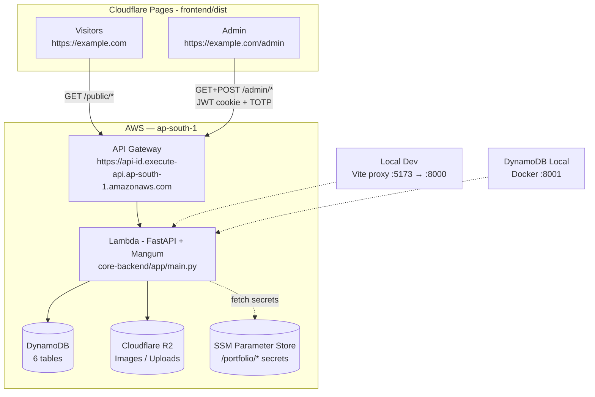
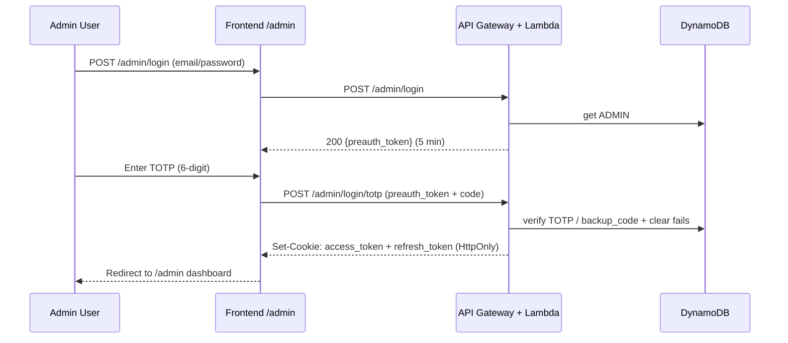

# Kanbs Portfolio

> **Project focus: backend.** The production value is `core-backend/` — a serverless FastAPI API (auth, blog/projects, profile, R2 uploads). The `frontend/` is a reference implementation and **swappable** — replace it with Next.js, Astro, mobile app, or any client that talks to the documented `/public/*` and `/admin/*` endpoints.

| Folder | What it is | Stack | Swappable? |
|---|---|---|---|
| `frontend/` | Reference public site + admin CMS (`/admin`) | React 19 + Vite 7 + Tailwind | **Yes — replace with your own** |
| `core-backend/` | **Core** — API for both apps | FastAPI + Mangum on AWS Lambda + API Gateway + DynamoDB + Cloudflare R2 | **No — keep** |

> **New to AWS / Cloudflare?** This guide is copy-paste friendly and safe to re-run. Local dev needs **no AWS account**.

---

## Table of Contents
1. [Architecture](#architecture)
2. [Prerequisites](#1-prerequisites)
3. [First Run — Local (5 min, no AWS)](#2-first-run--local-5-min-no-aws)
4. [Environment Variables](#3-environment-variables)
5. [Deploy to Production](#4-deploy-to-production-aws--cloudflare)
6. [Verify](#5-verify)
7. [Production Gotchas](#6-production-gotchas)
8. [Operations](#7-operations)
9. [Troubleshooting](#8-troubleshooting)
10. [Notes](#9-notes)

---

## Architecture





> Frontend is **swappable** — any client (Next.js/Astro/mobile) can call the same `VITE_API_URL`.

Secrets live in **AWS SSM Parameter Store** (`/portfolio/*`); never committed. Local dev uses `*.env` (git-ignored, copy from `*.env.example`). Global URL bases — change once:

- **Site base link:** `SITE_URL` (backend, `core-backend/.env`) and `VITE_SITE_URL` (frontend, `frontend/.env`) — default `https://example.com`
- **Image/CDN base:** `R2_PUBLIC_BASE_URL` (backend) and `VITE_IMG_BASE_URL` (frontend, `frontend/src/config.js:5`) — default `https://img.example.com`

> Keep `SITE_URL`/`R2_PUBLIC_BASE_URL` and `VITE_SITE_URL`/`VITE_IMG_BASE_URL` in sync. Backend CORS derives from `SITE_URL` (`core-backend/app/main.py:59`).

---

## 0. Swapping the Frontend

This repo is **backend-first**. Keep `core-backend/` and point any frontend at it:

- The contract is `VITE_API_URL` (or `SITE_URL` for links). All clients use the same REST API:
  - Public: `GET /public/blog`, `GET /public/projects`, `GET /public/bio`, `POST /public/comment/{blogId}`, etc. (`core-backend/app/api/public/*`)
  - Admin (JWT cookie): `POST /admin/login` → `POST /admin/login/totp` → CRUD on `/admin/blog`, `/admin/projects`, `/admin/upload/*`, etc. (`core-backend/app/api/admin/*` — see `core-backend/README` deleted, now in `/docs` at `/docs` when running locally)
- To use your own frontend, set `VITE_API_URL=https://<api-id>.execute-api.ap-south-1.amazonaws.com` (and optionally `VITE_SITE_URL`/`VITE_IMG_BASE_URL` from `frontend/src/config.js:5`) in your build. CORS is derived from `SITE_URL` (`core-backend/app/main.py:59` + `template.yaml:64`) — add your domain there before `sam deploy`.
- Example: `npx create-next-app` → `fetch(process.env.NEXT_PUBLIC_API_URL + "/public/projects")`. No backend changes needed.

> The included `frontend/` is fully functional but treated as an **example** — you can delete or replace `frontend/` entirely and the backend still deploys and runs standalone (`cd core-backend && ./scripts/deploy.sh`).

## 1. Prerequisites

| Tool | Version | Install | Verify |
|---|---|---|---|
| Node.js + npm | 20+ | https://nodejs.org | `node -v && npm -v` |
| Python | **3.13+** (`pyproject.toml:6`) | https://www.python.org | `python3 --version` |
| Docker | latest | https://www.docker.com | `docker --version && docker ps` |
| AWS CLI | v2 | https://docs.aws.amazon.com/cli/latest/userguide/getting-started-install.html | `aws --version` (required even locally — `scripts/start_local_db.sh` uses `aws dynamodb list-tables --endpoint-url`) |
| SAM CLI | latest | https://docs.aws.amazon.com/serverless-application-model/latest/developerguide/install-sam-cli.html | `sam --version` (prod only) |
| Cloudflare account | — | https://dash.cloudflare.com | prod only: R2 bucket + Pages |

**Prod only** — configure AWS:

```bash
aws configure  # region: ap-south-1, output: json
aws sts get-caller-identity  # expect your Account / Arn
sam --version
```

> No AWS/Cloudflare account yet? Stop after section 2 — local dev works without them.

---

## 2. First Run — Local (5 min, no AWS)

### 2.1 Backend

```bash
cd core-backend

# 1. Create & activate venv (Python 3.13)
python3 -m venv .venv && source .venv/bin/activate
pip install -r requirements.txt   # or: pip install -e .

# 2. Env — .env.example already has correct local defaults
cp .env.example .env
# Optional: edit .env — SITE_URL/R2_PUBLIC_BASE_URL already default to https://example.com / https://img.example.com
# Ensure DYNAMODB_ENDPOINT is set if you want dynamodb-local:
#   DYNAMODB_ENDPOINT=http://localhost:8001   (uncomment line 47 in .env)

# 3. Start persistent local DynamoDB (Docker volume survives reboots; safe to re-run)
./scripts/start_local_db.sh   # needs Docker + AWS CLI

# 4. Run API
uvicorn app.main:app --reload --port 8000
```

Expect: `Uvicorn running on http://127.0.0.1:8000` and docs at `http://localhost:8000/docs`.  
`.samignore` ensures `.env`/`.venv` never enter the Lambda zip.

### 2.2 Frontend

Open a **second terminal**:

```bash
cd frontend
cp .env.example .env   # VITE_API_URL=http://localhost:8000, VITE_SITE_URL=https://example.com, VITE_IMG_BASE_URL=https://img.example.com
npm install
npm run dev            # → http://localhost:5173
```

- Public site: `http://localhost:5173/`
- Admin CMS: `http://localhost:5173/admin`
- Vite proxies `/public` + `/admin` to `http://localhost:8000` (`vite.config.js:11`), so CORS is not needed locally.
- Local `AUTH_COOKIE_SECURE=false` + `SAMESITE=lax` (`core-backend/.env.example:25`) is required for `http://localhost`; prod uses `Secure=true` + `SameSite=none` via `template.yaml:47`.

> `VITE_API_URL` fallback: `src/api/client.js:3` falls back to `http://localhost:8000` when `!PROD`. For **production builds** you must set `VITE_API_URL=https://<api-id>.execute-api.ap-south-1.amazonaws.com` or the built `dist/` cannot reach the API.

### 2.3 Create admin account (once)

```bash
# BOOTSTRAP_SECRET from core-backend/.env (line 44) — change it before first deploy
curl -X POST http://localhost:8000/admin/auth/init \
  -H "x-bootstrap-secret: <BOOTSTRAP_SECRET>"

# → { "totp_secret": "...", "backup_codes": ["...", ...], "email": "admin@example.com" }
```

1. Add `totp_secret` to Authenticator app (Authy / Google Authenticator / 1Password).
2. Save `backup_codes` securely (shown once).
3. Open `http://localhost:5173/admin` → login with `ADMIN_EMAIL`/`ADMIN_PASSWORD` from `core-backend/.env:40` + 6-digit TOTP.

> `409 Admin credentials already initialized` → account already exists, just log in.

---

## 3. Environment Variables

### core-backend/.env (copy from .env.example)

| Var | Default | Purpose |
|---|---|---|
| `AWS_REGION` | `ap-south-1` | Lambda/DynamoDB region |
| `SITE_URL` | `https://example.com` | **Global base link** — share URLs + CORS origin derivation (`app/main.py:59`) |
| `ALLOWED_ORIGINS` | *(empty)* | Extra CORS origins, comma-separated (appended) |
| `R2_PUBLIC_BASE_URL` | `https://img.example.com` | **Global img base** — public R2/CDN URL (`services/storage.py:15`) |
| `R2_ACCOUNT_ID / R2_ACCESS_KEY_ID / R2_SECRET_ACCESS_KEY / R2_BUCKET_NAME` | *(empty)* | Cloudflare R2 upload creds |
| `JWT_SECRET` | *(random)* | HS256 signing key — rotate via SSM |
| `TOTP_ENCRYPTION_KEY` | *(Fernet key)* | Optional TOTP at-rest encryption |
| `ADMIN_EMAIL / ADMIN_PASSWORD / BOOTSTRAP_SECRET` | `admin@example.com` / `change-me` | One-time `/admin/auth/init` |
| `DYNAMODB_ENDPOINT` | `http://localhost:8001` (commented) | Uncomment for local DynamoDB |
| `AUTH_COOKIE_SECURE / AUTH_COOKIE_SAMESITE` | `false` / `lax` local, `true` / `none` prod | Cookie flags (see gotchas) |

### frontend/.env (copy from .env.example)

| Var | Default | Purpose |
|---|---|---|
| `VITE_API_URL` | `http://localhost:8000` | API base (prod: `https://<api-id>.execute-api...`) |
| `VITE_SITE_URL` | `https://example.com` | **Global base link** — keep in sync with backend `SITE_URL` (`src/config.js:5`) |
| `VITE_IMG_BASE_URL` | `https://img.example.com` | **Global img base** — keep in sync with backend `R2_PUBLIC_BASE_URL` (`src/config.js:6`) |
| `VITE_GA_ID` | *(empty)* | GA4 `G-XXXX` — leave empty to disable (`src/analytics.js:4`) |

Change **once** in the `.env` files and both site links + images update everywhere (`Hero.jsx:6`, `AboutPage.jsx:84`, `BlogList.jsx:45`, `MarkdownToolbar.jsx:68` all read from `config.js`).

---

## 4. Deploy to Production (AWS + Cloudflare)

### 4.1 One-command backend deploy

```bash
cd core-backend
./scripts/deploy.sh           # or: ./scripts/deploy.sh ap-south-1
```

What it does:

1. **SSM params** — `scripts/init_ssm.sh` creates `/portfolio/*` (`JWT_SECRET`, `BOOTSTRAP_SECRET`, `TOTP_ENCRYPTION_KEY`, `ADMIN_EMAIL`, `ADMIN_PASSWORD`, `R2_*`). Prompts for admin email/password + R2 (account ID, key ID, secret, bucket, public URL). Skips existing params.
2. **SAM build + deploy** — builds `template.yaml`, creates 6 DynamoDB tables (`BlogsTable`, `BlogCommentsTable`, `SkillsTable`, `ProjectsTable`, `ProfileTable`, `RateLimitsTable`), deploys Lambda + HTTP API Gateway. Honors `SITE_URL`/`ImgBaseUrl` SAM params (defaults in `template.yaml:26`).
3. **Admin init** — `POST /admin/auth/init` with `BOOTSTRAP_SECRET` from SSM, prints `totp_secret` + `backup_codes`.

Output:

```
=== Deployment complete ===
API base URL:   https://<api-id>.execute-api.ap-south-1.amazonaws.com
TOTP setup:     {"totp_secret": "...", "backup_codes": [...], "email": "admin@example.com"}
```

**Save now:** API URL (needed for frontend) + add `totp_secret` to authenticator + backup codes.

> Re-running `deploy.sh` is safe — SSM skips existing, SAM updates in place, `409 Already initialized` on second init is expected.

### 4.2 Step-by-step alternative

```bash
cd core-backend
./scripts/init_ssm.sh          # interactive prompts
sam build
sam deploy                     # uses samconfig.toml (stack: portfolio-backend, region: ap-south-1)
# To override global URLs:
# sam deploy --parameter-overrides SiteUrl=https://mydomain.com ImgBaseUrl=https://cdn.mydomain.com

API_URL=$(aws cloudformation describe-stacks --stack-name portfolio-backend --region ap-south-1 \
  --query "Stacks[0].Outputs[?OutputKey=='ApiUrl'].OutputValue" --output text)
echo "$API_URL"

BOOT=$(aws ssm get-parameter --name /portfolio/BOOTSTRAP_SECRET --with-decryption \
  --region ap-south-1 --query Parameter.Value --output text)
curl -X POST "$API_URL/admin/auth/init" -H "x-bootstrap-secret: $BOOT"
```

### 4.3 Frontend → Cloudflare Pages

```bash
cd frontend
npm install
# Must set all globals for production:
VITE_API_URL="https://<api-id>.execute-api.ap-south-1.amazonaws.com" \
VITE_SITE_URL="https://example.com" \
VITE_IMG_BASE_URL="https://img.example.com" \
VITE_GA_ID="G-XXXX" \
npm run build   # → dist/
```

`dist/` is static:

- **Option A — drag & drop:** Cloudflare dashboard → Workers & Pages → Create → Pages → Upload `dist/`.
- **Option B — Git connected:** Connect repo, set env vars `VITE_API_URL`, `VITE_SITE_URL`, `VITE_IMG_BASE_URL`, `VITE_GA_ID` in Cloudflare Pages → Settings → Environment variables. SPA fallback: redirect `/*` → `/index.html` (200).

> Updating `SITE_URL` later? Change `core-backend/.env` (`SITE_URL`) + `frontend/.env` (`VITE_SITE_URL`/`VITE_IMG_BASE_URL`) + pass `SiteUrl`/`ImgBaseUrl` to `sam deploy`.

---

## 5. Verify

```bash
API_URL="https://<your-api-id>.execute-api.ap-south-1.amazonaws.com"

curl -s -o /dev/null -w "%{http_code}\n" "$API_URL/public/projects"   # 200
curl -s -X POST "$API_URL/admin/login" -H "Content-Type: application/json" \
  -d '{"email":"admin@example.com","password":"<ADMIN_PASSWORD>"}'      # → { preauth_token }

# Frontend
curl -s -o /dev/null -w "%{http_code}\n" https://example.com/          # 200
# Admin login: https://example.com/admin → email/password → TOTP → Dashboard
```

---

## 6. Production Gotchas

- **Local vs prod cookies.** Local `.env.example:25` defaults `AUTH_COOKIE_SECURE=false` + `SAMESITE=lax` for `http://localhost`. Prod Lambda forces `Secure=true` + `SameSite=none` via `template.yaml:47` so Pages → API Gateway cross-site XHR sends cookies. Same-site deployments may tighten to `strict` — change both `app/core/config.py:28` and `template.yaml:48`.
- **Never bundle `.env`.** Prod secrets come from SSM; `DYNAMODB_ENDPOINT` must be empty in Lambda. `.samignore` excludes `.env`/`.venv` from `sam build`.
- **CORS two places.** Backend derives origins from `SITE_URL` (`app/main.py:59` → `https://example.com`, `www.`, `admin.`, `www.admin.`, `localhost`, `pages.dev`). Gateway list is `template.yaml:64` (`CorsConfiguration`). Keep `SITE_URL`/`SiteUrl` and `VITE_SITE_URL` in sync.
- **Rate limiting is app-level** (no WAF on HTTP APIs): `POST /admin/login` + `/admin/login/totp` 10/min, `/admin/auth/init` 5/5 min, `POST /public/comment/{blogId}` 30/10 min, plus 5 failed logins → 15 min lockout. Fail-open if rate table unavailable; gateway also throttles `POST /admin/login` bursts. Returns `429 Retry-After`.
- **`sam deploy` is re-runnable.** DynamoDB tables (PAY_PER_REQUEST, 6 tables) are never replaced; schema-less, so new fields need no migration.

---

## 7. Operations

### Rotate secrets

```bash
aws ssm put-parameter --name /portfolio/JWT_SECRET --value "$(openssl rand -base64 48)" --type SecureString --overwrite --region ap-south-1
sam build && sam deploy   # rotation invalidates all sessions (refresh tokens bump token_version)
# If secret was ever committed:
git filter-repo --path core-backend/.env --invert-paths  # purge history, force-push
```

### Which admin email is active?

`.env`/SSM only used at `POST /admin/auth/init`; login checks DynamoDB:

```bash
# Local
aws dynamodb get-item --endpoint-url http://localhost:8001 --table-name ProfileTable \
  --key '{"PK": {"S": "ADMIN#CREDENTIALS"}, "SK": {"S": "METADATA"}}' \
  --projection-expression "email, updated_at" --region ap-south-1
# Prod: omit --endpoint-url
```

### Lost authenticator / backup codes

TOTP is encrypted at rest and unrecoverable — reset:

```bash
aws dynamodb delete-item --table-name ProfileTable --region ap-south-1 \
  --key '{"PK": {"S": "ADMIN#CREDENTIALS"}, "SK": {"S": "METADATA"}}'
# Then re-init (step 4.2) — new totp_secret + backup codes, old sessions revoked
```

---

## 8. Troubleshooting

| Symptom | Fix |
|---|---|
| `No changes to deploy` | Not an error — already up to date |
| `409 Admin credentials already initialized` | Already init — log in |
| `Missing required SSM parameters` | Run `./scripts/init_ssm.sh` or `deploy.sh`, then `sam deploy` |
| `429` on login | Rate/lockout hit — wait 1–15 min (`Retry-After` header) |
| Admin login works locally, 401 in prod | Cross-site cookie — keep `SAMESITE=none` + `SECURE=true` (section 6) |
| `ServerlessHttpApi` reserved ID warning | Harmless |
| Changes not showing after deploy | `sam build` before `sam deploy` |
| `docker: not found` / `aws: not found` locally | Install Docker + AWS CLI (section 1) |
| Frontend blank / API 404 | `VITE_API_URL` empty in prod build — rebuild with it set (section 4.3) |
| CORS error in browser console | `SITE_URL`/`VITE_SITE_URL`/`SiteUrl` mismatch — update all three + redeploy |

---

## 9. Notes

- **Stack:** FastAPI · Mangum · Python 3.13 · Lambda + API Gateway (HTTP API) · DynamoDB (6 tables) · R2 · Cloudflare Pages.
- **API docs:** `http://localhost:8000/docs` (local) or `$API_URL/docs`.
- **Rate limiting:** per IP (app) + gateway throttling; `429` with `Retry-After`.
- **Uploads:** max 10 MB, allow-list + magic-byte check (`app/api/admin/upload.py:20`), extensions `jpg/png/gif/webp/avif/ico/pdf/mp4/webm`.
- **Ports:** API `8000`, local DynamoDB `8001`.
- **License:** MIT — see `LICENSE` (`Copyright (c) 2026 Kartik Nagare`). `frontend/package.json:4` + `core-backend/pyproject.toml:6` declare `MIT`.
- **Security:** see `SECURITY.md` — report via `kartiknagare3165@gmail.com`, never commit `.env`.

